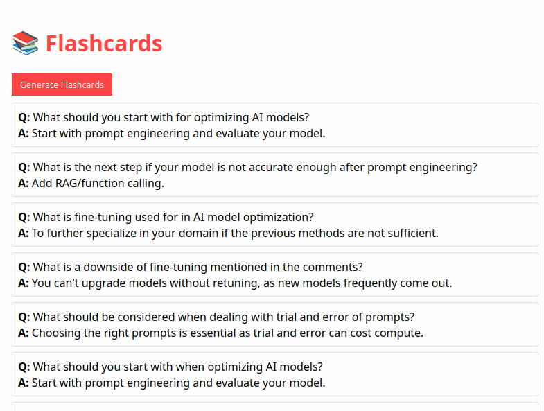

# YouTube Flashcard Generator



Reference Video: [RAG vs Fine-Tuning vs Prompt Engineering: Optimizing AI Models](https://www.youtube.com/watch?v=zYGDpG-pTho)

Generate spaced-repetition flashcards from YouTube videos using AI!
This project is a browser extension (Chrome/Firefox) and a Node.js backend that extracts video transcripts and creates flashcards using OpenAI.

---

## Features

- Extracts transcript from YouTube videos
- Generates 5 flashcards per video using OpenAI
- Stores flashcards locally for review
- Works in Chrome and Firefox (local development)

---

## Prerequisites

- Node.js (v16+ recommended)
- npm
- OpenAI API key ([get one here](https://platform.openai.com/))
- Chrome or Firefox browser

---

## Setup

### 1. Clone the repository

```sh
git clone https://github.com/yourusername/yt-flashcard-ai.git
cd yt-flashcard-ai
```

### 2. Install backend dependencies

```sh
npm install
```

### 3. Set up environment variables

Create a `.env` file in the project root:

```
OPENAI_API_KEY=your_openai_api_key_here
```

### 4. Start the backend server

```sh
node server.js
```
You should see:
```
🚀 Flashcard API running at http://localhost:5050
```

---

## Browser Extension Setup

### Chrome (local testing, free)

1. Go to `chrome://extensions/`
2. Enable **Developer mode**
3. Click **Load unpacked**
4. Select the project folder

### Firefox (local testing, free)

1. Go to `about:debugging#/runtime/this-firefox`
2. Click **Load Temporary Add-on**
3. Select `manifest.json` from the project folder

---

## Usage

1. Open a YouTube video.
2. Click the extension icon.
3. In the popup, click **Generate Flashcards**.
4. Flashcards will appear in the popup.

---

## Troubleshooting

- **No flashcards?**  
  - Make sure the backend server is running.
  - Check browser console for errors.
  - Ensure your OpenAI API key is valid.

- **Network errors?**  
  - Use `127.0.0.1` instead of `localhost` in all URLs and permissions.

- **Popup too small?**  
  - Adjust `styles.css` for better layout.

---

## Contributing

Pull requests and suggestions are welcome!  
Please open an issue for bugs or feature requests.

---

## License

MIT

---

## Credits

- [OpenAI](https://openai.com/)
- [YouTube](https://youtube.com/)

---

**Enjoy learning with AI-powered flashcards!**
